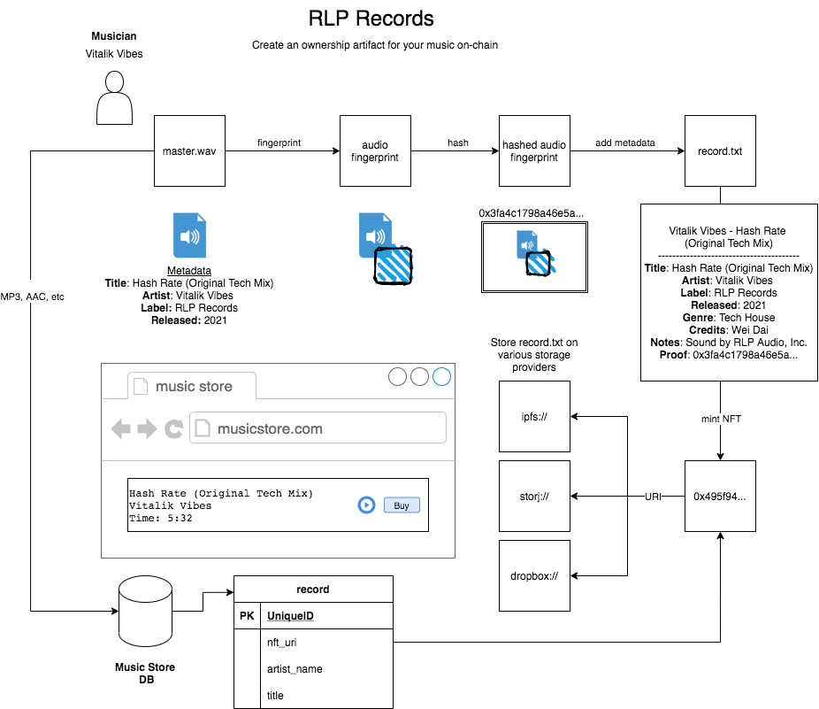

# RLP Records 
> Create and publish an own chain artifact for musical works

Web3 app to mint and manage Ethereum ERC-721 tokens claiming ownership of an audio file's hashed audio fingerprint.

## Claiming Music Ownership
* Musician creates a mastered track ("To Publish")
* Application determines audio fingerprint
* Hash that finger print
* Store hashed audio finger print and meta data (title, artist name, record label, if any) as a file on IPFS
		* Potential to extend the platform and create your own record label 
* Mint NFT token with pointer to that URI 
* A musician or publisher who owns the account has now published and claims ownership of that track

## Web Interface
The contract is front end agnostic. Music files can actually be stored off chain and distributed by major digital music providers (e.g. iTunes, Beatport, TraxSource, etc)

* Allow user to upload music, draft and mint an ownership token for their music
* Allow user to play their tracks (music stored off-chain on server)
* Allow musicians to create their own record label that "owns" all the music
	 * Technically it would just be a name at the start
* Allow users to publish their music to digital music stores 

### Proof of Concept
* Audio fingerprint engine
* NFT contracts and IPFS data storage
* Mint record via web app

### v0
* Sign up
* Create a record label
* See tracks that you own
	 * Would require a self-custody wallet 
* Mint a record -> stores on IPFS
