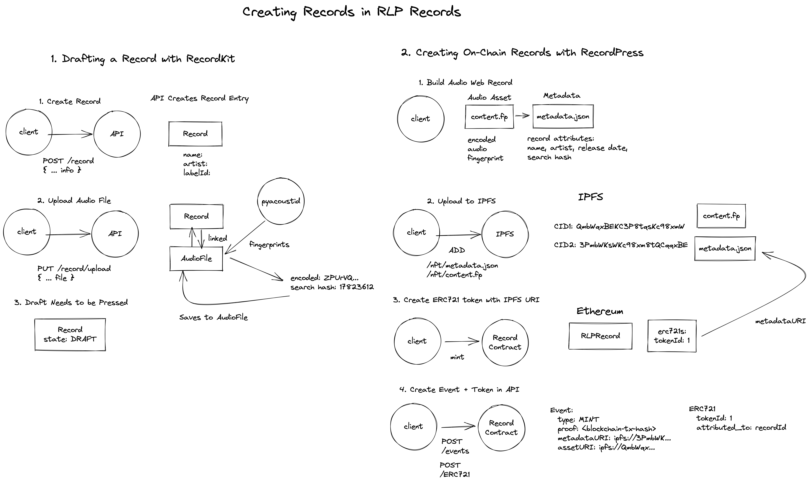

# RLP Records 
Alright so here's a fun idea: 

> A decentralized audio registry system which uses preexisting acoustic fingerprinting algorithms to generate an acoustic fingerprint for a given digital audio file's content and then writes that fingerprint and associated identifying data to a file stored within a public immutable and distributed file system that is linked to a non-fungible token within a separate immutable digital ledger. 

## Explain Yourself
RLP Records is a smaller scope prototype of a more grandiose idea I thought up that probably exists I call "The Audio Web". 

In essence, RLP Records is a web application that allows artists to sign up and mint NFTs for their musical works with a twist. In specific, instead of minting a token that contain an IPFS URI which points to stored `.json` data on IPFS hopefully containing a URL pointer an image or resource the NFT represents ownership of, an "Audio Web Record" derives an audio fingerprint hash from the audio file and bundles this hash into the IPFS `.json` file entry. 

```
// MyAudioWebRecord.json
{
	fingerprint: "..."
	name: "My Audio Web Record",
	artist: "Me",
	year: 2022,
}
```

The benefit of doing this is to make the NFT claim towards an actual derived datum rather than a _pointer_ to a datum which can be changed at will.

The basic idea is:

```
Artist creates music 
Artist forms on-chain Record Label
Artist mints NFT and API records connection to the Record Label

Developers use "The Audio Web" registry as an index of what label owns which music (as asserted by fingerprints) and whom they should pay royalties to after sale of music.
```

[](./docs/design.md)

## How It Works
This is a prototype for the idea, but you can see the flow of creating a record below.

There are three areas of RLP Records: the RecordKit, RecordPress and RecordStack.

The RecordKit is responsible for drafting Records to release
The RecordPress is responsible for uploading and creating NFTs for Record drafts
The RecordStack is where a user can see all their Records



## Getting Started
RLP Records concept is composed of three parts:

1. [webclient](./webclient/README.md): React Frontend Client 
2. [blockchain](./blockchain/README.md): ETH Hardhat Solidity Project
3. [lib/contracts](./lib/contracts/README.md) Shared Contract Artifacts NPM Package
4. [api](./api/README.md): Django Backend API

Each of these projects are compartmentalized and can be developed individually with an accompanied `README.md` in each folder. 

You will need to follow the setup instructions in each folder in order to get started, and then you can run the root `Makefile` containing all the commands you need to run it. 

### Requirements
- python & pip
- docker
- node, npm, yarn
- hardhat 
- ipfs (specifically for `--offline` development)
