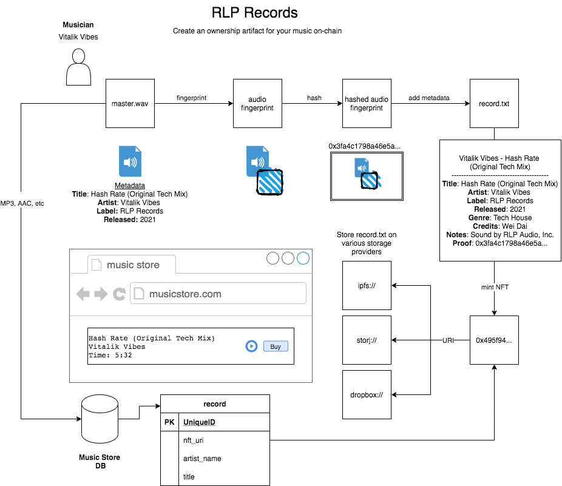

# The idea

RLP Records is a scaled down prototype for a concept I call "The Audio Web". 

The Audio Web would be a global digital audio content registration, royalty and publishing system enabling any developer to programmatically access metadata information about a record.

Musical IP is a highly desirable asset in the modern digital economy.  This desirability is evidenced by the continued growth in consumption and production of registered musical works by professional and amateur musicians. Yet, despite the high demand for new musical IP, the market for such IP remains opaque and illiquid. Authors are often challenged by the dilemma in needing to distribute, market and monetize creations and the registration and enforcement of intellectual property rights to those creations. To solve this issue, authors often partner contractually with record companies who provide counsel and guidance in the musical IP registration process. However, if there were easy to use tools to setup a musical work's registration and potential royalty payments in an automated fashion, many more musicians could begin building their own record labels more easily.

## RLP Records
In essence, RLP Records is a web application that allows artists to sign up and mint NFTs for their musical works with a twist. In specific, instead of minting a token that contain an IPFS URI which points to stored `.json` data on IPFS hopefully containing a URL pointer an image or resource the NFT represents ownership of, RLP creates an "Audio Web Record" composed of two files `content.fp`, an audio fingerprint hash from the audio file, and `metadata.json` containing information about the artist, publication and title of the work.

```
// metadata.json
{
	name: "My Audio Web Record",
	artist: "Me",
	year: 2022,
    uri: ipfs://uri-to-content-fingerprint-file
}
```

In this way the NFT represents a derived datum rather than a _pointer_ to a datum which can be changed.

The basic idea is:
```
Artist creates music 
Artist forms on-chain Record Label
Artist mints NFT

Developers use "The Audio Web" registry as an index of what label owns which music (as asserted by fingerprints) and whom they should pay royalties to after sale of music.
```


